<div align="center">


<a href="https://github.com/iamadityakumar/forge">
  
</a>

<p>
  <a href="https://iamadityakumar.github.io"></a>
  <a href="https://linkedin.com/in/iammadityakumar"></a>
  <a href="https://leetcode.com/u/iamadityakumar/"></a>
  <a href="mailto:aditya.kumar.iiitb@gmail.com"></a>
  
</p>

</div>

---

## 👋 Hi, I'm Aditya

Final year student at **IIIT Bhopal**. I like the parts of software that only show up when things go wrong: crashes, retries, rate limits, race conditions. Then I like proving the fix works.

```go
type Aditya struct {
    Building   []string // Forge, LiveCanvas, AgentCLI
    Fascinated []string // crash recovery, cache hierarchies, agent tooling
    Solving    string   // LeetCode, mostly DP, graphs and segment trees
    Looking    string   // SWE internships: backend, AI infra, developer tools
}
```

---

## 🛠️ What I've built

<table>
<tr>
<td width="50%" valign="top">

### ⚡ [Forge](https://github.com/iamadityakumar/forge)
An AI agent job queue that keeps working after a worker gets killed mid task. No lost steps, no repeated tool calls, no wasted tokens.

`Go` `PostgreSQL` `Docker` `Prometheus` `Jaeger`

[Repo](https://github.com/iamadityakumar/forge) · [Live demo](https://4orge.duckdns.org/dashboard)

</td>
<td width="50%" valign="top">

### 🎨 [LiveCanvas](https://github.com/iamadityakumar/livecanvas)
A shared whiteboard where you watch a friend's stroke appear while they are still drawing. Global undo and redo that never disagrees.

`TypeScript` `WebSocket` `Canvas` `Node.js`

[Repo](https://github.com/iamadityakumar/livecanvas) · [Live demo](https://livecanvas.duckdns.org)

</td>
</tr>
<tr>
<td width="50%" valign="top">

### 🤖 [AgentCLI](https://github.com/iamadityakumar/agentCLI)
A coding assistant that lives in your terminal. It reads your files, edits your code and runs your scripts, all through tool calls.

`Python` `Gemini` `Tool calling`

</td>
<td width="50%" valign="top">

### 🧠 [Cache Simulator](https://github.com/iamadityakumar/cache-simulator)
See what your CPU does with memory. Replays access patterns through three cache levels and finds the fastest setup.

`C++` `CMake` `109 tests`

</td>
</tr>
<tr>
<td width="50%" valign="top">

### 📬 [ReachInbox](https://github.com/iamadityakumar/reachinbox)
Email scheduling with no cron jobs, per sender hourly limits and full recovery after a server restart.

`React` `Node.js` `BullMQ` `Redis` `PostgreSQL`

</td>
<td width="50%" valign="top">

### 🛰️ Hy-BiSSM
Faculty mentored research on classifying land cover from satellite images. Reached 92.63% accuracy across 2.26M labeled pixels.

`PyTorch` `Mamba` `3D CNN`

</td>
</tr>
</table>

### 📌 Live repo status

<div align="center">

<a href="https://github.com/iamadityakumar/forge"></a>


<br/>
<a href="https://github.com/iamadityakumar/livecanvas"></a>


<br/>
<a href="https://github.com/iamadityakumar/agentCLI"></a>


<br/>
<a href="https://github.com/iamadityakumar/cache-simulator"></a>


</div>

---

## 🧰 Toolbox

<div align="center">


</div>

---

## 📊 By the numbers

<div align="center">




</div>

<p align="center">
<a href="https://github.com/iamadityakumar?tab=repositories">

</a>
</p>

### 🧩 LeetCode


</div>

---

## 🐍 Contribution snake

<div align="center">
<picture>
  <source media="(prefers-color-scheme: dark)" srcset="https://raw.githubusercontent.com/iamadityakumar/iamadityakumar/output/github-snake-dark.svg" />
  <source media="(prefers-color-scheme: light)" srcset="https://raw.githubusercontent.com/iamadityakumar/iamadityakumar/output/github-snake.svg" />
  
</picture>
</div>

---

## ⏱️ Recent activity

<!--START_SECTION:activity-->
<!--END_SECTION:activity-->

---

## 🎯 What I'm looking for

A software engineering internship where I get to work on **backend systems, AI infrastructure or developer tools**, with people who care about reliability as much as features.

If that sounds like your team, [say hello](mailto:aditya.kumar.iiitb@gmail.com).

<div align="center">


<sub>Build things. Break things. Understand why. Build them better.</sub>

</div>